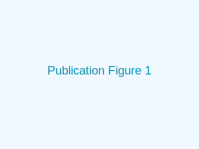
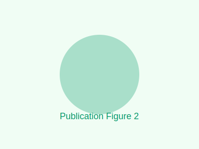

## Abstract

Lorem ipsum dolor sit amet, consectetur adipiscing elit. Sed do eiusmod tempor incididunt ut labore et dolore magna aliqua. Ut enim ad minim veniam, quis nostrud exercitation ullamco laboris nisi ut aliquip ex ea commodo consequat.

## Introduction

Lorem ipsum dolor sit amet, consectetur adipiscing elit [@barrelmeyer2025]. Sed do eiusmod tempor incididunt ut labore et dolore magna aliqua.

## Methodology

Lorem ipsum dolor sit amet, consectetur adipiscing elit. Sed do eiusmod tempor incididunt:

$$
f(x) = \int_{-\infty}^{\infty} \hat{f}(\xi) e^{2\pi i \xi x} d\xi
$$

Ut enim ad minim veniam, quis nostrud exercitation ullamco laboris.

## Results

### Experimental Data

*Figure 1: Example experimental setup for data collection.*

| Condition | Value A | Value B | Result |
|-----------|---------|---------|--------|
| Case 1    | 12.3    | 45.6    | 78.9   |
| Case 2    | 23.4    | 56.7    | 89.0   |
| Case 3    | 34.5    | 67.8    | 90.1   |

*Table 1: Example experimental results.*

*Figure 2: Comparative visualization of performance metrics across conditions.*

## Discussion

Lorem ipsum dolor sit amet, consectetur adipiscing elit. Sed do eiusmod tempor incididunt ut labore et dolore magna aliqua. Ut enim ad minim veniam.

## Conclusion

Lorem ipsum dolor sit amet, consectetur adipiscing elit. Sed do eiusmod tempor incididunt ut labore et dolore magna aliqua.

## References

[^ref]
