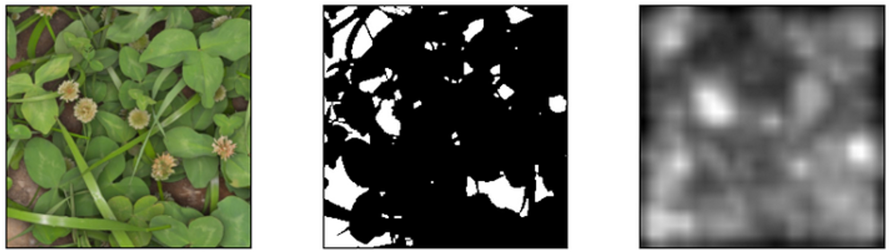

## Abstract

Processing clover grass meadows for human consumption requires the detection of unwanted plants before or during harvest. Deep learning based anomaly detection presents a potential approach to solve this task, having shown promising results in other domains, but has not been evaluated in the agricultural domain. In this study the “Outlier Probability Based Feature Adaptation on contaminated data“ method presented in [@zhou2024outlier] was reimplemented, adapted and evaluated for anomaly detection in grass clover. The Method is based in a feature extractor, a feature adaptor trained based on contrastive learning using LoOP [@kriegel2009loop] scores, a gaussian mixture model based memory bank and distance based scoring. A modified GrassClover dataset [@skovsen2019grassclover] is used for training and evaluation. Performance evaluation on MVTec AD [@bergmann2019mvtec] show a reduced AUROC of 0.9427 compared to the reported results in [@zhou2024outlier]. The performance further degrades to AUROC 0.5333 when evaluated on the modified GrassClover dataset. Fine-tuning of the feature extractor on the DeepWeeds dataset [@olsen2019deepweeds] using cross entropy loss and supcon loss as well as tuning of hyperparameters allow an increase of AUROC to 0.6522. The use of a swin-transformer based feature extractor, regularization with von Neumann entropy and the modification of the used score function fail to further increase performance in anomaly detection. Complementing the training with synthetic anomalies could not be implemented successfully. It can be concluded that the adaptation of anomaly detection into the grassland domain poses significant challenges that are not addressed by methods that work in the general plant detection setting.

*Figure 1: Synthetic grass-clover-meadow from*  [@skovsen2019grassclover]*, the corresponding ground truth for anomaly detection and the generated anomaly score map of a modified OPFA network.*

[View thesis (PDF)](/public/Masterarbeit_Gerrit_Lange.pdf)

## References

[^ref]
