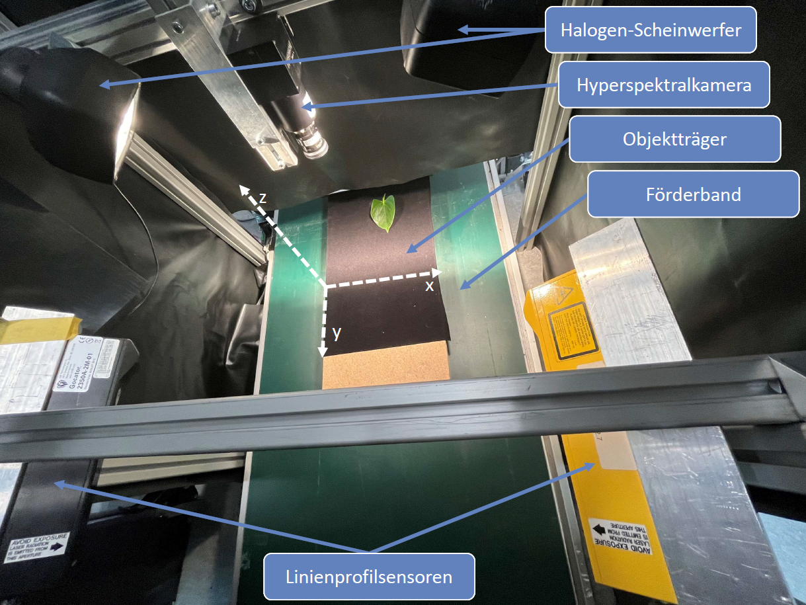
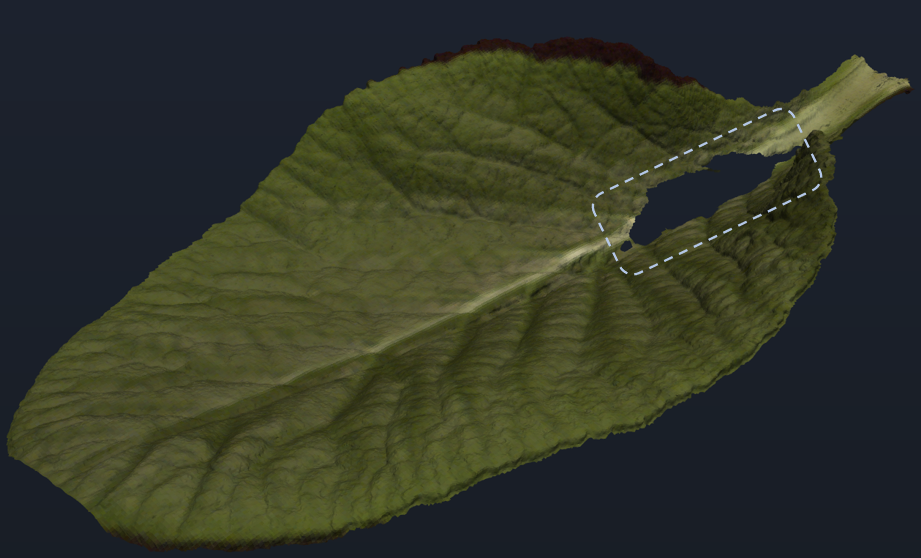
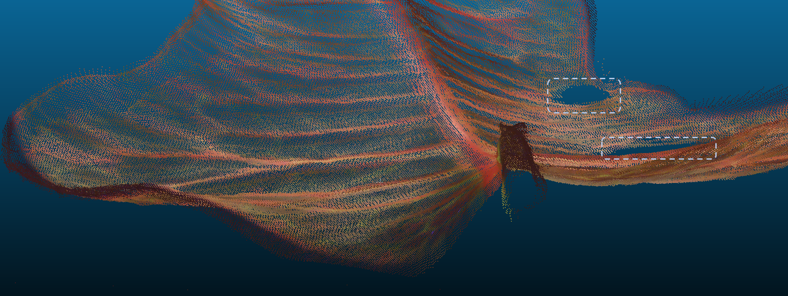

## Abstract

Agriculture today faces many economic and environmental challenges. Among other things, the increasing digitalisation of agriculture is seen as a basis for the further development of agriculture to meet these challenges. Artificial intelligence and machine learning can be seen as important core technologies. However, in order to train their algorithms, large amounts of training data are required, the data of which are usually difficult to collect under real conditions. Therefore, this work develops an open-source visual inspection system to capture and fuse geometric and spectral information under laboratory conditions is developed to generate synthetic plant training models. For this purpose, two laser-lineprofilers and a Pushbroom hyperspectral camera are combined in a benchtop experimental setup. The generated datasets of the recorded plant test objects are then algorithmically processed, merged into hyperspectral point clouds and exported as textured meshes for further use. Finally, the results of the plant samples and the developed visual inspection system are evaluated, discussed and validated. The evaluations show that the developed visual inspection system is more powerful than those of comparable scientific work.

## Introduction

Agriculture is an essential economic sector and a critical component of global food production. The German government's Zukunftskommission Landwirtschaft identified 15 fields of action for making agriculture more sustainable and future-proof, with increasing digitalization as a central pillar [@ZukunftskommissionLandwirtschaftZKL.2021]. AI and ML are key technologies for enabling crop yield forecasting, soil analysis, and plant phenotyping [@Chlingaryan.2018]. However, ML models require vast amounts of high-quality training data. Since such data are often unavailable or difficult to capture in real environments due to interference and variability, the generation of synthetic training data based on physical plant models presents a promising alternative [@seib2020mixing].

### Motivation

- Synthetic training data enable AI systems to learn in diverse, realistic virtual scenarios — regardless of season, weather, or location [@seib2020mixing]
- Hyperspectral imaging offers far richer plant information than RGB or multispectral data: chlorophyll content, water stress, disease indicators, and canopy properties can all be inferred from spectral signatures [@Bergstrasser.2015]
- No existing open-source system simultaneously captures both the geometry and full hyperspectral information of plant leaves with sufficient resolution for synthetic training data generation

### Research Questions

1. How can geometric and hyperspectral plant data be captured simultaneously in a laboratory setting with sub-millimeter spatial precision?
2. How can laser line profile and hyperspectral sensor data be fused into accurate, textured 3D meshes?
3. Does the developed system outperform state-of-the-art comparable systems in spectral and spatial resolution?

## Related Work

Prior systems for fusing 3D and spectral plant data fall into two categories — multispectral and hyperspectral.

**Multispectral-3D systems:** An early terrestrial full-waveform hyperspectral LiDAR recording broadband reflectance in multiple wavelengths (400–1300 nm) was presented in [@TeemuHakala.2012]. A multi-wavelength laser line profiling system (MWLP) using multiple line lasers of different wavelengths offers sub-millimeter spatial resolution and spectral information derived from laser-induced excitation [@Strothmann.2014]. Image-based fusion of photogrammetric point clouds with multispectral images has also been explored [@Jurado.2020], though mismatched resolutions between RGB and multispectral cameras require k-nearest-neighbor interpolation to compensate for missing data.

**Hyperspectral-3D systems:** A laboratory system combining snapshot HSI (20 nm resolution, 400–1000 nm) with RGB-based triangulation achieved point clouds of approximately 7,500 points from 36 captures, outperforming its reference systems in speed and accuracy [@Zia.2015]. Most directly comparable to this work, Behmann et al. fused line-scan hyperspectral cameras (ImSpector V10E: 2.8 nm resolution, 400–1000 nm) with LiDAR for plant phenotyping, achieving a LiDAR Z-resolution of 0.024 mm [@Behmann.2015; @Behmann.2016]. The system developed in this thesis surpasses this benchmark in spectral resolution (2.1 nm vs. 2.8 nm) and Z-resolution (0.019 mm vs. 0.024 mm).

## Methodology

The experimental setup consists of a conveyor belt system carrying plant samples beneath a sensor bridge. Two Gocator 2350A laser line profile sensors (LMI Technologies) are mounted at opposing angles to capture overlapping geometry from both sides, compensating for occlusions from steep leaf walls. A Resonon Pika L pushbroom hyperspectral camera (281 spectral channels, 400–1000 nm, 2.1 nm spectral resolution) is aligned above the conveyor. Sample position is tracked precisely via an incremental rotary encoder.

*Figure 1: Physical setup of the benchtop visual inspection system.*

The data fusion pipeline follows this process:

$$
P_{fused} = \mathcal{F}(P_{geo}, P_{hsi}) = \arg\min_{\theta} \| \pi(P_{geo}; \theta) - P_{hsi} \|^2
$$

Where $P_{geo}$ is the geometric point cloud, $P_{hsi}$ is the hyperspectral image cube, $\theta$ are the calibration/transformation parameters optimized via particle swarm optimization (PSO), and $\pi$ is the projection function. Steps include: sensor-specific calibration, black-white reflectance normalization, Savitzky-Golay spectral smoothing, PSO-based pixel-accurate alignment, and Poisson surface reconstruction for mesh generation.

## Implementation

The full software pipeline is implemented in Python using ROS for sensor communication and Open3D for 3D data processing.

The system architecture covers: (1) ROS-based sensor drivers for both Gocator and Pika L, (2) a calibration module using ArUco markers, (3) PSO-based alignment optimization, and (4) Open3D mesh reconstruction and texture baking for export to standard formats (`.ply`, `.obj`).

## Results

### Experimental Results

Test objects included primrose (*Primula*), croton (*Codiaeum*), and fern leaves, selected to represent a range of surface geometries and reflectance properties.

*Figure 2: Reconstructed pseudo-RGB mesh of a primrose leaf, showing fine vein detail.*

The system achieves a Z-axis spatial resolution of 0.019 mm (Gocator 2350A specification), outperforming the 0.024 mm of the closest comparable system [@Behmann.2015; @Behmann.2016]. Spectral resolution of 2.1 nm exceeds the 2.8 nm of the state-of-the-art benchmark [@Behmann.2015]. Custom spectral calibration additionally outperforms the manufacturer's default calibration in accuracy. The dual-sensor configuration successfully compensates for measurement shadows caused by steep leaf walls that would prevent a single-sensor setup from achieving full coverage.

## Discussion

The system fulfills all defined requirements and surpasses comparable systems from the literature in both spectral and spatial resolution. A key strength is the simultaneous capture design: by synchronizing sensors via encoder feedback, geometric and hyperspectral data are captured in a single conveyor pass, avoiding the registration errors common in sequential multi-sensor setups.

Limitations identified include: (1) specular reflections on glossy surfaces (e.g., croton leaves) introduce localized noise in the point cloud; (2) strong undercuts (steep leaf walls > ~70°) remain partially occluded even with dual-sensor geometry; (3) halogen illumination introduces thermal drift and limits future SWIR extension due to heat generated near temperature-sensitive detectors. Additionally, the current particle swarm optimization step, while accurate, is computationally intensive and may bottleneck throughput for large-scale scanning applications.

*Figure 3: Colorized point cloud of a croton leaf — gaps (circled) indicate areas of total reflection where the laser profiler could not detect surface information.*

Compared to the snapshot-HSI approach of [@Zia.2015], the pushbroom design of this system offers higher spectral resolution but requires accurate motion control. Compared to [@Behmann.2015; @Behmann.2016], the open-source nature of this system and its improved spectral resolution make it better suited as a reproducible research platform.

## Conclusion

This thesis presents a complete, open-source benchtop visual inspection system for generating synthetic plant training models from fused distance and hyperspectral sensor data. The system captures sub-millimeter geometry and 2.1 nm spectral resolution simultaneously, exceeds the state of the art, and exports production-ready textured 3D meshes suitable for direct use in AI training pipelines and virtual simulation environments.

### Future Work

- Full automation of scan control and pipeline execution via programmable motor interfaces
- Extension of the spectral range into SWIR (up to 2500 nm) using cooled InGaAs sensors, enabling leaf water and dry matter analysis [@YuwenChen]
- Integration of leaf transmission measurements to recover cellular structural information not accessible via reflectance alone [@Bergstrasser.2015]
- Direct embedding of generated plant models into virtual AI learning environments for end-to-end synthetic data pipelines

## References

[^ref]