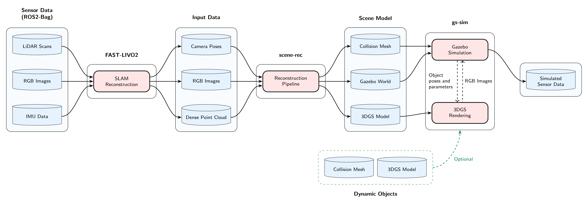
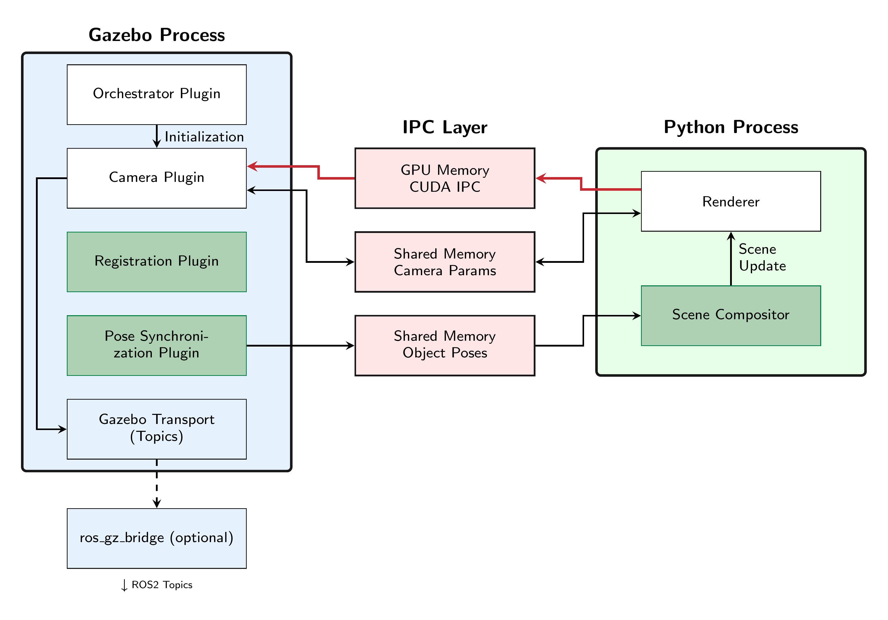

import halleGz from './halle-gz.mp4';
import halleGs from './halle-gs.mp4';
import gz93 from './93-gz.mp4';
import gs93 from './93-gs.mp4';
import siGz from './si-gz.mp4';
import siGs from './si-gs.mp4';
import pylonenGz from './pylonen-gz.mp4';
import pylonenGs from './pylonen-gs.mp4';

export const compareHover =
  "const rect=this.getBoundingClientRect();" +
  "const pct=Math.max(0,Math.min(100,(event.clientX-rect.left)/rect.width*100));" +
  "const v=this.querySelector('.top-layer');" +
  "const d=this.querySelector('.compare-divider');" +
  "const h=this.querySelector('.compare-handle');" +
  "v.style.clipPath='inset(0 '+(100-pct)+'% 0 0)';" +
  "d.style.left=pct+'%';" +
  "h.style.left=pct+'%';";

export const compareSync =
  "const r=this.closest('.video-compare');" +
  "const f=r.querySelector('.top-video');" +
  "if(Math.abs(f.currentTime-this.currentTime)>0.1){f.currentTime=this.currentTime;}";

export const VideoSlide = ({bottom, top, autoplay = false, hidden = false}) => (
  

    <video autoplay={autoplay} muted loop playsinline ontimeupdate={compareSync}
      style="position:absolute; top:0; left:0; width:100%; height:100%; object-fit:cover;">
      <source src={bottom} type="video/mp4" />
    </video>
    3DGS
    

      <video class="top-video" autoplay={autoplay} muted loop playsinline
        style="position:absolute; top:0; left:0; width:100%; height:100%; object-fit:cover;">
        <source src={top} type="video/mp4" />
      </video>
      Gazebo
    

    

    

      ◀
      ▶
    

  

);

export const switchSlider =
  "const r=this.closest('.slider-switcher');" +
  "const t=this.dataset.sliderTarget;" +
  "r.querySelectorAll('.video-compare').forEach((s,i)=>{" +
  "const active=String(i)===t;" +
  "s.style.display=active?'block':'none';" +
  "s.querySelectorAll('video').forEach(v=>{if(active){v.play().catch(()=>{});}else{v.pause();}});" +
  "});" +
  "r.querySelectorAll('button[data-slider-target]').forEach(b=>{const a=b.dataset.sliderTarget===t;b.style.background=a?'#00aacc':'#fff';b.style.color=a?'#fff':'#111';b.style.borderColor=a?'#00aacc':'#ccc';});";

## Abstract

Mobile robots increasingly rely on vision-based algorithms, yet their development in simulation is hindered by the visual discrepancy between simulated and real camera images. 3D Gaussian Splatting enables photorealistic rendering from real image data in real time, offering a promising approach to overcoming this so-called Sim-to-Real Gap.

The goal of this thesis was to enable a workflow in which a mobile robot drives through a scene once and the recorded sensor data is automatically turned into a photorealistic Gazebo simulation of the same robot in the same environment. To this end, a modular reconstruction pipeline was developed that creates a dual scene representation consisting of a collision mesh and a 3D Gaussian Splatting model as well as the corresponding Gazebo simulation world based on a SLAM reconstruction. A rendering backend integrated into Gazebo couples the physics simulation with the photorealistic rendering through an asynchronous architecture, so that the camera pose for rendering is obtained directly from the physics simulation. Evaluation on self-recorded datasets showed that the pipeline generates all simulation files automatically and that the integrated rendering easily achieves real-time capability.

  <VideoSlide bottom={halleGs} top={halleGz} autoplay={true} />
  <VideoSlide bottom={gs93}   top={gz93}   hidden={true} />
  <VideoSlide bottom={siGs}   top={siGz}   hidden={true} />

  

    <button
      type="button"
      data-slider-target="0"
      onclick={switchSlider}
      style="flex:1 1 0; max-width:8rem; height:3.75rem; padding:0 0.6rem; line-height:3.75rem; text-align:center; box-sizing:border-box; border:1px solid #00aacc; background:#00aacc; color:#fff; border-radius:6px; cursor:pointer; font:inherit; margin:0;"
    >Dataset 1</button>
    <button
      type="button"
      data-slider-target="1"
      onclick={switchSlider}
      style="flex:1 1 0; max-width:8rem; height:3.75rem; padding:0 0.6rem; line-height:3.75rem; text-align:center; box-sizing:border-box; border:1px solid #ccc; background:#fff; color:#111; border-radius:6px; cursor:pointer; font:inherit; margin:0;"
    >Dataset 2</button>
    <button
      type="button"
      data-slider-target="2"
      onclick={switchSlider}
      style="flex:1 1 0; max-width:8rem; height:3.75rem; padding:0 0.6rem; line-height:3.75rem; text-align:center; box-sizing:border-box; border:1px solid #ccc; background:#fff; color:#111; border-radius:6px; cursor:pointer; font:inherit; margin:0;"
    >Dataset 3</button>
  

## Motivation

Mobile robots increasingly take on demanding tasks in real, unstructured environments such as agriculture and logistics. Developing the required vision-based algorithms directly on physical robots is expensive, risky and hard to scale. Simulation is the established alternative, but it suffers from a visual mismatch with real camera imagery. This mismatch severely limits the transfer of vision-based algorithms from simulation to reality.

- **3D Gaussian Splatting** renders photorealistically in real time from real image data [@kerbl3Dgaussians] and has been shown to narrow this gap [@wuRLGSBridge3DGaussian2025].
- A purely visual 3DGS representation is not sufficient on its own, since it does not support physical collisions. A **dual scene representation** combining a collision mesh and a 3D Gaussian Splatting model is required.
- Existing approaches lack the necessary automation, and **Gazebo** has so far had no native, coupled 3D Gaussian Splatting solution.

This thesis addresses these gaps with an automated end-to-end pipeline that turns a single sensor recording of a mobile robot into a ready-to-launch photorealistic Gazebo simulation of that robot in its environment.

## Pipeline Overview

The system processes a single recording of a mobile robot's sensor data (RGB, LiDAR, IMU) into a ready-to-use photorealistic Gazebo simulation world. The end-to-end pipeline consists of three stages:

1. **Data recording & SLAM reconstruction:** FAST-LIVO2 [@Zheng.2024] produces the point clouds and camera poses used as input.
2. **Reconstruction pipeline:** from these inputs the pipeline generates a collision mesh, a 3D Gaussian Splatting model and a Gazebo world that links the two.
3. **Coupled simulation in Gazebo:** the physics engine uses the collision mesh, while the integrated 3D Gaussian Splatting rendering backend asynchronously generates camera images based on the robot pose and publishes them as a Gazebo topic.

*Figure 1: End-to-end pipeline from sensor data to photorealistic simulation.*

## Reconstruction Pipeline

The reconstruction stage turns a SLAM result into the simulation assets. The pipeline is decoupled from any specific SLAM implementation and only requires inputs in standardized formats, so the SLAM stage can be swapped without affecting the rest.

The collision mesh is reconstructed from the LiDAR scans with VDBFusion [@vizzoVDBFusionFlexibleEfficient2022], and the resulting mesh is smoothed and simplified. The 3D Gaussian Splatting model is trained with gsplat [@yeGsplatOpenSourceLibrary2024], using an additional depth-supervised loss. To enable this loss, the fused LiDAR point cloud is projected into each training view to produce an inverse depth image. The depth supervision suppresses floating artifacts and keeps the model metrically consistent with the physics scene.

Because both representations are derived from the same SLAM reconstruction, they share a common coordinate frame by construction. The pipeline finally emits a Gazebo world file that links the collision mesh and the 3D Gaussian Splatting model into a ready-to-launch simulation.

## 3D Gaussian Splatting Rendering integrated into Gazebo

The 3DGS rendering is embedded in Gazebo by running it as a separate process, while the simulator-side integration is implemented through Gazebo plugins. These plugins cover the simulation of cameras as well as the registration and pose synchronization of dynamic 3D Gaussian Splatting objects. The two processes communicate over an IPC layer that combines POSIX shared memory for camera parameters and object poses with CUDA IPC for transferring the rendered images back from the renderer.

                                                                            

                                                                  

*Figure 2: Architecture of the rendering integration. The Gazebo process owns physics and sensor management, while a separate Python process performs CUDA-based 3DGS rendering.*

**Camera integration.** Each simulated camera is exposed in Gazebo through a sensor plugin that forwards the camera pose and parameters to the renderer and publishes the returned image as a Gazebo topic. Cameras are detected automatically from the robot description files. Rendered images are handed back to Gazebo as a zero-copy exchange between the two processes.

**Dynamic scene objects.** Photorealistic rendering is not limited to the static scanned environment. Any Gazebo model can be tagged in the SDF as an object with a 3D Gaussian Splatting representation, which couples its physical representation in the simulation with a corresponding 3D Gaussian Splatting model on the renderer side. Its pose is then mirrored to the renderer and the renderer composes the static scene model as well as all active dynamic object models into a single 3D Gaussian Splatting scene before each render pass. As a result, newly added obstacles such as pylons appear photorealistically in the camera stream while still being physically simulated by Gazebo.

## Results

The system was evaluated on self-recorded indoor and outdoor datasets from Osnabrück University of Applied Sciences. In addition to the upstream SLAM reconstruction, which is treated as a separate, exchangeable step, the pipeline runs unattended in roughly 36 to 45 minutes per dataset and produces a launch-ready simulation without manual intervention.

A representative example of such a simulation is shown in Figure 3, where a robot navigates around pylons that have been placed in the simulation at runtime. The pylons act as physical obstacles for the navigation stack and at the same time appear photorealistically in the simulated camera stream.

<figure style="margin:2rem 0;">
  <VideoSlide bottom={pylonenGs} top={pylonenGz} autoplay={true} />
  <figcaption style="text-align:center; font-style:italic; margin-top:0.75rem;">
    Figure 3: Navigation around dynamically added pylons. Move the cursor over the video to compare the simulated camera stream rendered by Gazebo (left) and by the integrated 3D Gaussian Splatting backend (right).
  </figcaption>
</figure>

Beyond this qualitative demonstration, the central quantitative question is whether the integrated rendering keeps up with the frame rates typical for robotics cameras.

*Table 1: Rendering latency for a single camera at three resolutions on the Mensa dataset.*

| Resolution     | Render time in ms | Total latency in ms | Max. frame rate in Hz |
|----------------|-----------------:|-------------------:|---------------------:|
| 640 × 480      |             3.22 |               4.19 |                  239 |
| 1280 × 720     |             3.20 |               4.91 |                  204 |
| 1920 × 1080    |             3.89 |               7.12 |                  140 |

A robotics setup, however, often relies on more than one camera in parallel. The same measurement was therefore repeated with up to three simultaneous cameras at 1280 × 720 and 30 FPS in Table 2. Since the renderer serializes GPU access, total latency grows mainly with the time a camera waits for the renderer.

*Table 2: Rendering latency with up to three simultaneous cameras at 1280 × 720 and 30 FPS on the SI dataset.*

| Cameras          | Render time in ms | Wait time in ms | Total latency in ms |
|------------------|-----------------:|---------------:|-------------------:|
| 1                |             2.56 |           0.00 |               4.55 |
| 2 (worst case) |             2.61 |           2.83 |               7.58 |
| 3 (worst case) |             2.67 |           5.58 |              10.48 |

The pipeline produces all simulation files fully automatically, the integrated rendering reaches real-time performance with substantial headroom on a single camera, and the system still scales comfortably to multiple cameras. Together they enable the path from a single data recording to photorealistic robotics simulation in Gazebo.

