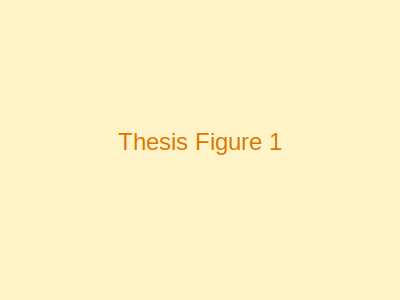
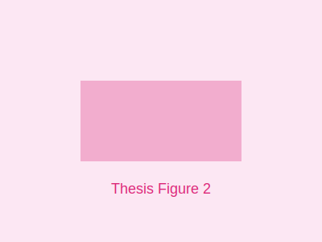

## Abstract

Lorem ipsum dolor sit amet, consectetur adipiscing elit. Sed do eiusmod tempor incididunt ut labore et dolore magna aliqua. Ut enim ad minim veniam, quis nostrud exercitation ullamco laboris nisi ut aliquip ex ea commodo consequat. Duis aute irure dolor in reprehenderit in voluptate velit esse cillum dolore eu fugiat nulla pariatur.

## Introduction

Lorem ipsum dolor sit amet, consectetur adipiscing elit. Sed do eiusmod tempor incididunt ut labore et dolore magna aliqua [@barrelmeyer2025].

### Motivation

Lorem ipsum dolor sit amet, consectetur adipiscing elit. Sed do eiusmod tempor incididunt ut labore et dolore:

- Lorem ipsum dolor sit amet
- Consectetur adipiscing elit
- Sed do eiusmod tempor incididunt

### Research Questions

1. Lorem ipsum dolor sit amet?
2. Consectetur adipiscing elit sed do?
3. Ut enim ad minim veniam quis?

## Related Work

Lorem ipsum dolor sit amet, consectetur adipiscing elit. Sed do eiusmod tempor incididunt ut labore et dolore magna aliqua.

## Methodology

Lorem ipsum dolor sit amet, consectetur adipiscing elit:

$$
y = mx + b
$$

Sed do eiusmod tempor incididunt ut labore et dolore magna aliqua.

## Implementation


*Figure 1: Overview of the implemented system architecture.*

```python
def example_function(data):
    """Process input data"""
    result = process(data)
    return result

# Example usage
output = example_function(input_data)
```

## Results

### Experimental Results

| Test Case | Metric A | Metric B | Performance |
|-----------|----------|----------|-------------|
| Test 1    | 85.2%    | 12.3ms   | Good        |
| Test 2    | 91.7%    | 15.8ms   | Excellent   |
| Test 3    | 88.4%    | 14.1ms   | Good        |

*Table 1: Example results.*


*Figure 2: Performance comparison across different test scenarios.*

## Discussion

Lorem ipsum dolor sit amet, consectetur adipiscing elit. Sed do eiusmod tempor incididunt ut labore et dolore magna aliqua. Ut enim ad minim veniam.

## Conclusion

Lorem ipsum dolor sit amet, consectetur adipiscing elit. Sed do eiusmod tempor incididunt ut labore et dolore magna aliqua.

### Future Work

- Lorem ipsum dolor sit amet
- Consectetur adipiscing elit
- Sed do eiusmod tempor

## References

[^ref]
