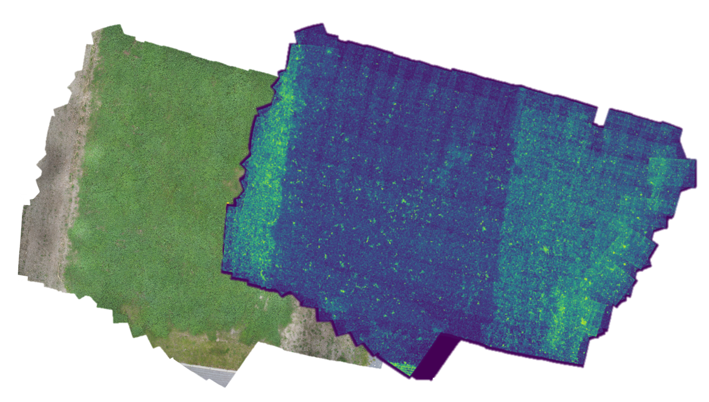

## Abstract

In the context of the [ZERN Grünland](https://zern-verbund.de/themenbereiche-2/themenbereich-gruenland/) project we investigate methods for the detection and mapping of anomalous regions in grass-clover meadows. What is considered normal can be project specific and may include particular plant species as well as vegetation or health states. Detection is based on AI models, using high resolution UAV imaging with sub-centimeter ground sampling distances processed into orthoimages as a primary data source.

## Research topics

- Sub-centimeter GSD photogrammetry for low-structure environments
- Deep learning-based anomaly detection on contaminated and fine-grained data
- Robust model inference under varying outdoor conditions

*Figure 1: 1 mm GSD orthomosaic of a grass-clover test site and the corresponding anomaly map.*

## Funding

This research was funded by the Lower Saxony Ministry of Science and Culture and the Volkswagen Foundation as part of the zukunft.niedersachsen program

