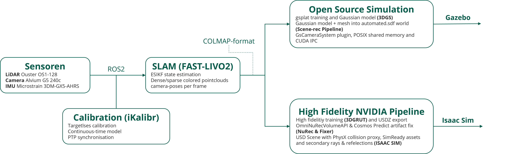
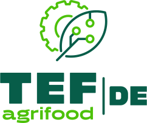

## Abstract

Modern robotic systems increasingly rely on large, diverse datasets of high-fidelity 3D scene representations for training and evaluating AI/ML models. Real-world data collection remains costly, environment-dependent, and difficult to scale. This work presents a pipeline that fuses LiDAR-Inertial-Visual odometry (FAST-LIVO2) with 3D Gaussian Splatting to generate photorealistic, physics-ready simulation environments **on the fly** from a single sensor pass. FAST-LIVO2 provides accurate, real-time pose estimation and a dense colorized point cloud from synchronized **LiDAR, IMU, and camera** data. This shared geometric foundation feeds two parallel simulation integration paths: an open-source path embedding trained Gaussians directly into Gazebo as native ROS 2 sensors, and a high-fidelity path exporting 3DGRUT/NuRec-rendered USDZ assets into NVIDIA Isaac Sim. This dual-path architecture provides a scalable foundation for synthetic data generation in smart robotics applications.

## Research topics

- **Scalable synthetic data generation:** Robotic AI systems require large, diverse training datasets — on-the-fly simulation from real sensor captures offers a cost-effective, environment-independent alternative to manual collection.
- **Sensor fusion for scene reconstruction:** Single-pass LiDAR-Inertial-Visual fusion enables simultaneous geometric and photometric scene capture, a key prerequisite for automated reconstruction workflows.
- **Simulation-ready 3DGS integration:** Bridging the gap between novel view synthesis and physics-based simulators (Gazebo, Isaac Sim) remains an open challenge with high relevance for agricultural and industrial robotics.

## Methods & Motivation

- FAST-LIVO2 enables real-time, tightly coupled LiDAR-Inertial-Visual odometry with high pose accuracy and low drift, producing dense colored point clouds suitable as initialization for downstream 3DGS training [@Zheng.2024]
- 3D Gaussian Splatting offers real-time novel view synthesis with higher rendering fidelity than NeRF-based approaches for bounded scenes, while remaining differentiable and trainable on commodity hardware [@Kerbl.2023]
- **Open-source path:** gsplat [@Ye.2024] provides a flexible, open-source 3DGS training library. The integration of the trained Gaussian model into Gazebo as a native ROS 2 camera sensor — without any proprietary runtime dependencies — was developed exclusively as part of the master's thesis by Malte Klöpping [Malte Klöpping](../theses/MalteKloepping_Thesis_2026).
- **High-fidelity path:** 3DGRUT [@Moenne-Loccoz.2024; @Wu.2025] and NVIDIA NuRec with Fixer [@Fixer.2025] provide production-grade tools for ray-traced, artifact-reduced rendering with distorted camera support, surpassing open-source pipelines in visual quality and simulator integration depth

## Funding

This research was supported by the research project “agrifoodTEF-DE” (funding program Digitalisierung in der Landwirtschaft, grant number 28DZI04A23) funded by the Federal Ministry of Agriculture, Food and Regional Identity (BMLEH) based on a decision of the Parliament of the Federal Republic of Germany via the Federal Office for Agriculture and Food (BLE).

## References

[^ref]