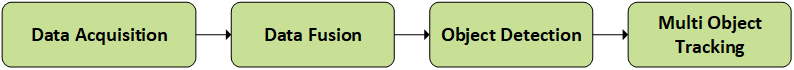
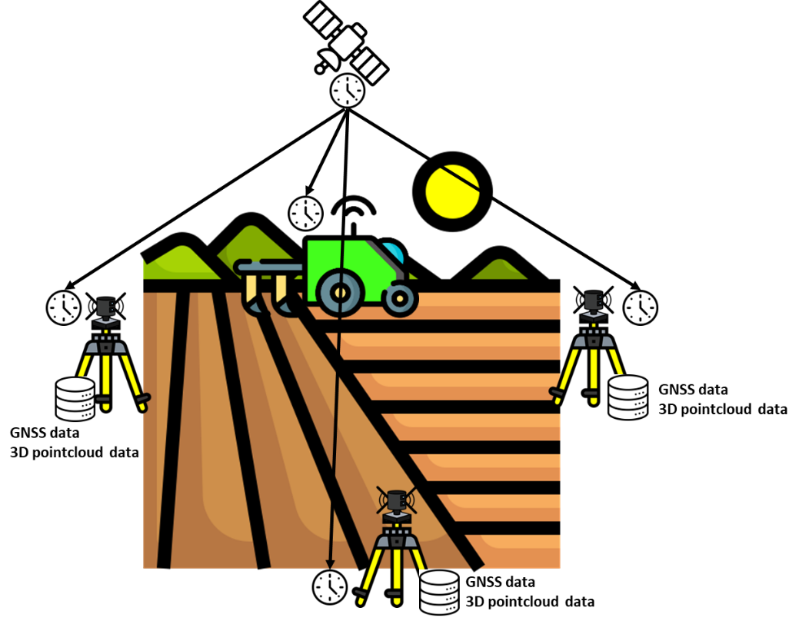
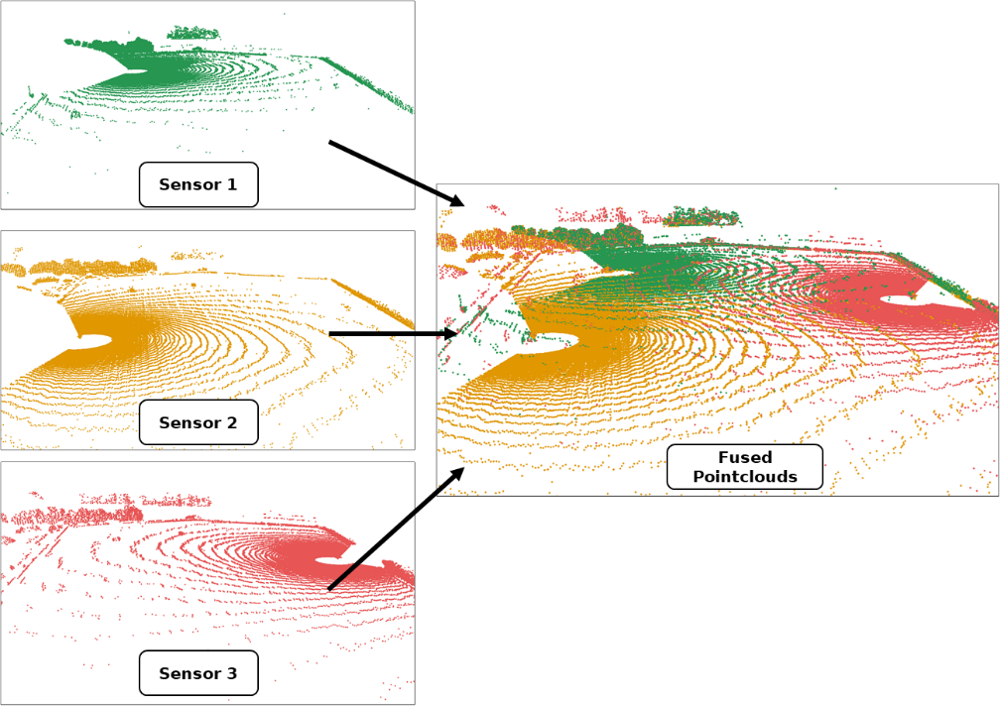
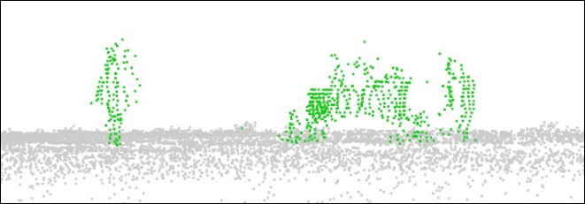
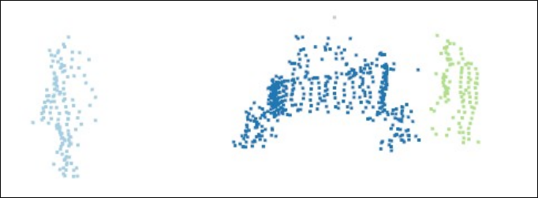
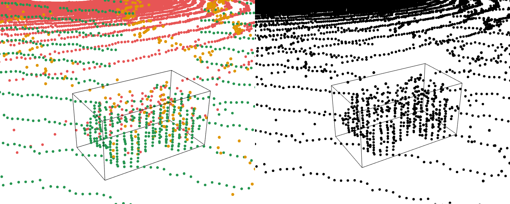
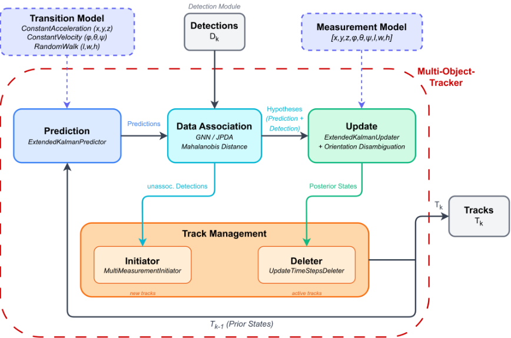
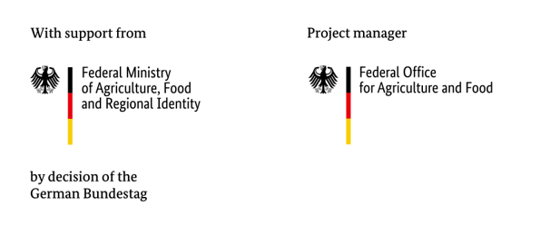

 
import videoSrc from './multi_object_tracking_demo.mp4';
import mdpi_paper_preview_Src from './mdpi_paper_preview.png';
import vdi_paper_preview_Src from './vdi_paper_preview.png';

<video autoplay muted loop playsinline style="width:100%; border-radius:8px;">
  <source src={videoSrc} type="video/mp4" />
  Your browser does not support the video tag.
</video>

## Overview
Autonomous agricultural robots are increasingly deployed in real farming environments. These 
systems operate in complex and dynamic outdoor settings where they must interact safely with 
humans, animals, and other machines. Ensuring the reliability and the correct behavior of such 
systems requires validation under realistic field conditions. Existing validation approaches often 
rely on stationary test infrastructures, focus primarily on sub-system levels like individual 
sensors, or are limited to single-object scenarios.

Our research addresses this issue by developing a **testing setup** that can be used in a wide 
range of settings.   
The setup
- is **mobile** and **self-sufficient** (independent of fixed energy supply or communication 
infrastructure)
- enables independent detection of the **position**, **orientation** and **extent** of objects
- enables simultaneous detection of **multiple dynamic objects**
- is capable of monitoring **agricultural areas** of **realistic size**
- enables **georeferencing** of information
- supports use cases such as **geofencing** and **environmental perception**
- is able to treat **objects as black boxes** (without information exchange)

## Mobile Sensor Stations
The setup is based on at least three sensor stations. Each sensor station is equipped with a 
high-resolution 3D LiDAR sensor, a GNSS receiver for time synchronization and georeferencing, and 
an edge computing unit for data acquisition. The stations are mounted on portable tripods and 
powered by autonomous battery systems, enabling flexible deployment without additional 
infrastructure.

By distributing several sensor stations around the area of interest, the environment can be 
observed from multiple viewpoints. This configuration reduces occlusions and allows the system to 
capture dynamic objects over large field areas.

*Figure 1: Picture of one assembled sensor station.*

| Component | Model | Manufacturer |
|----------|-------|--------------|
| 3D LiDAR | OS2-128 | Ouster, Inc. (San Francisco, USA) |
| GNSS Receiver | simpleRTK3B (mosaic-H) | ArduSimple / Septentrio |
| GNSS Antenna (2×) | AS-ANT2B-CAL-L1L2-15SMA | ArduSimple |
| Battery | PowerHouse 767 | Anker Innovations |
| Tripod | BST-K-L | STABILA Messgeräte Gustav Ullrich GmbH |
| Edge Computer | NRU-220S-JAO64G (Jetson AGX Orin) | Neousys Technology / NVIDIA |

*Table 1: Hardware components of a sensor station.*

## Multi-Object Tracking Pipeline

The software pipeline of the framework focuses on transforming raw measurements from multiple
mobile sensor stations into georeferenced object trajectories that can serve as ground truth for 
field experiments. The pipeline takes synchronized 3D LiDAR and GNSS data as input and produces 
detections and temporally consistent tracks of dynamic objects such as agricultural robots or 
humans. In this way, the system provides an external and explainable reference for evaluating 
navigation, geofencing, and environmental perception functions of autonomous agricultural robots.

*Figure 2: Scheme (high-level) of multi object tracking workflow*

### Data Acquisition

The data acquisition is performed by several mobile sensor stations positioned around the area of 
interest. Each station combines a high-resolution 3D LiDAR sensor with GNSS-based time 
synchronization and georeferencing, while an edge computer records the measurement streams locally
as rosbags in the mcap file format.

*Figure 3: A simplified scheme of data acquisition, including sensor positioning, recording, and satellite communication for timestamping.*

### Data Fusion

After acquisition, the measurements of the individual sensor stations are synchronized in time and 
aligned in space to form a common point cloud representation of the scene. GNSS-based timestamps 
provide a shared temporal reference, while registration methods combine the LiDAR scans into a 
consistent global frame. This fusion step is essential because it expands the observable area, 
improves the spatial impression of objects, and reduces blind spots that would occur when relying 
on a single station only.

*Figure 4: Individual point clouds captured by three sensors (green, orange, and red), and their
combined (fused) point cloud, which is subsequently used for the detection.*

### Object Detection

Object detection begins with the separation of dynamic objects from the static environment. For 
this purpose, a reference scan of the scene without moving objects is used to identify structures 
that remain unchanged over time. In addition, region-of-interest constraints and dedicated 
filtering steps remove irrelevant measurements and reduce the amount of data that has to be 
processed in later stages.

*Figure 5: Ground filter applied to an example point cloud with two
people and an agricultural robot.*

A dedicated ground-filtering stage is applied to suppress terrain points and retain only 
measurements that are likely to belong to relevant objects. Since agricultural environments often 
contain uneven terrain and sparse vegetation, robust geometric filtering is required before 
segmentation can be performed reliably. The remaining points are subsequently grouped into object 
candidates using density-based clustering methods.

*Figure 6: Result of clustering a multi-object scene.*

For each resulting cluster, geometric object properties are estimated in the form of 
three-dimensional bounding boxes. These bounding boxes describe the position, orientation, and 
spatial extent of the object and thus provide the measurement input for the tracking stage. 
The detection module is deliberately based on interpretable geometric processing rather than 
end-to-end learning, making the resulting ground truth easier to analyze and validate.

*Figure 7: Visualisation of fused 3D point cloud data with an oriented bounding box highlighting the
detected robot. The left image shows colour-coded data points from multiple sensors, while the right
image displays a monochrome version of the same data for clarity.*

### Multi Object Tracking

The tracking stage links object detections across time and estimates temporally consistent 
trajectories for all visible objects. The system follows a tracking-by-detection paradigm in which 
the bounding boxes extracted from the fused point clouds are used as detections for a 
probabilistic multi-object tracker. Motion prediction, data association, state update, and track 
management are combined to maintain stable identities even in challenging situations such as 
temporary occlusions, close interactions, or missed detections. This allows the system to generate 
robust trajectories that can be used as quantitative ground truth for validating autonomous 
agricultural robots in dynamic field scenarios.

*Figure 8: Architecture of the multi-object tracker.*

## Example Use Cases

*Figure 9: Visualisation of example use cases (geofencing, trajectory tracking and environment perception).*

### Geofencing
Autonomous agricultural robots must respect predefined safety zones during operation. The 
developed ground-truth system enables the validation of geofencing functionality by providing 
precise trajectories of the robot within the test environment. By comparing the ground-truth 
trajectory with the defined geofence boundaries, it becomes possible to determine whether the 
robot correctly detects and reacts to boundary violations. This allows researchers to evaluate 
both the timing and spatial accuracy of safety-related system responses under realistic field 
conditions.

### Trajectory Tracking
The tracking system can also be used to evaluate the navigation performance of autonomous robots. 
By reconstructing the ground-truth trajectory of the robot from the fused LiDAR observations, the 
system provides an independent reference for assessing localization and path-following accuracy. 
The resulting trajectories can be compared with the navigation data reported by the robot itself, 
allowing deviations and systematic localization errors to be identified. This makes it possible to 
quantitatively analyze navigation performance in large outdoor environments.

### Environment Perception
Another important application of the test environment is the evaluation of human–robot (or other 
dynamic objects) interaction 
scenarios. In agricultural fields, robots must operate safely in the presence of human workers. 
By tracking both the robot and human participants simultaneously, the system can reconstruct their 
relative motion and spatial relationships over time. This allows safety-related behaviors such as 
obstacle avoidance, safe stopping distances, and reaction times to be analyzed in dynamic 
multi-object situations.

## Field Tests and Datasets
Some field trials and results are described in [@barrelmeyer2025]. Datasets are available upon request.

More information is coming soon.

## Research Contributions

This research topic provides:

- mobile ground-truth infrastructure for field robotics  
- multi-object tracking for agricultural environments 

## Current and Future Work
  
- accuracy validation with robotic total station (laser tracker)
- benchmark datasets for environment perception tasks of agricultural robots 
 

## Publications

### Mobile Ground-Truth 3D Detection Environment for Agricultural Robot Field Testing

**Barrelmeyer, D., Stiene, S., Jose, J., Porrmann, M.**

*Sensors, 2025*

[Paper](https://doi.org/10.3390/s25134103)

### Environment for Testing Agricultural Robots in the Field with Ground Truth 3D Object Tracking

**Barrelmeyer, D., Jose, J., Stiene, S.**

*VDI LAND.TECHNIK AgEng Conference, 2025*

[Conference Proceedings](https://doi.org/10.51202/9783181024652)

## Collaboration

If you are interested in collaboration, please contact 
- Stefan Stiene - s.stiene@hs-osnabrueck.de
- Daniel Barrelmeyer - daniel.barrelmeyer@hs-osnabrueck.de
- Jannik Jose - jannik.jose@hs-osnabrueck.de

---
## Acknowledgments and Funding
This research was supported by the research project “agrifoodTEF-DE” (funding program Digitalisierung in der Landwirtschaft, grant number 28DZI04A23) funded by the Federal Ministry of Agriculture, Food and Regional Identity (BMLEH) based on a decision of the Parliament of the Federal Republic of Germany via the Federal Office for Agriculture and Food (BLE).

## References

[^ref]

