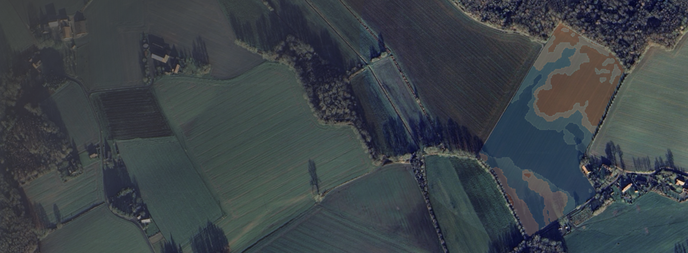
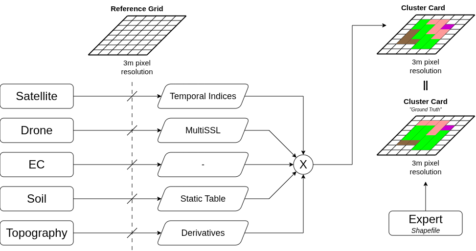
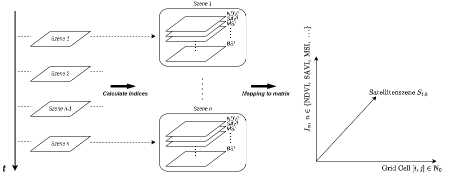
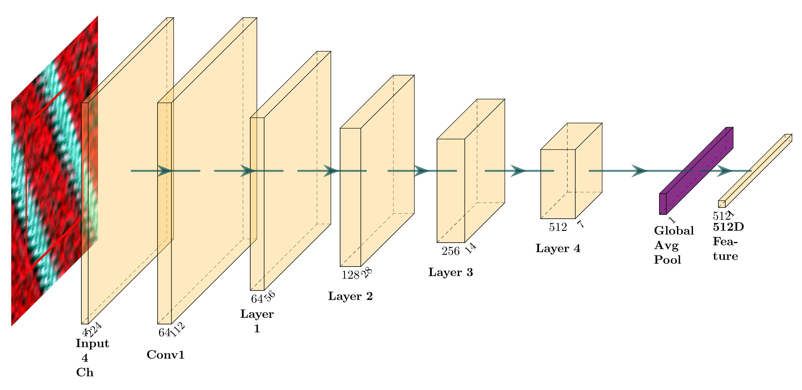
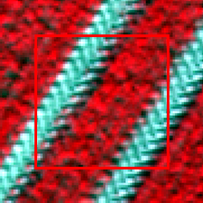
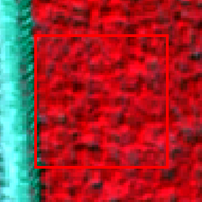
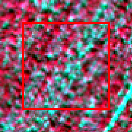
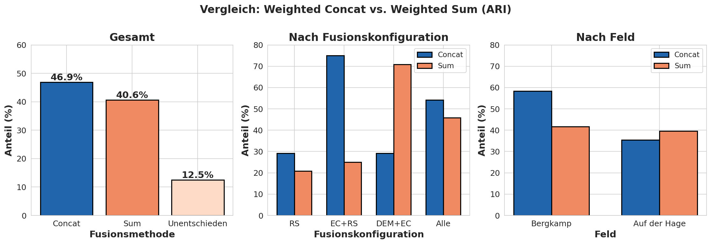
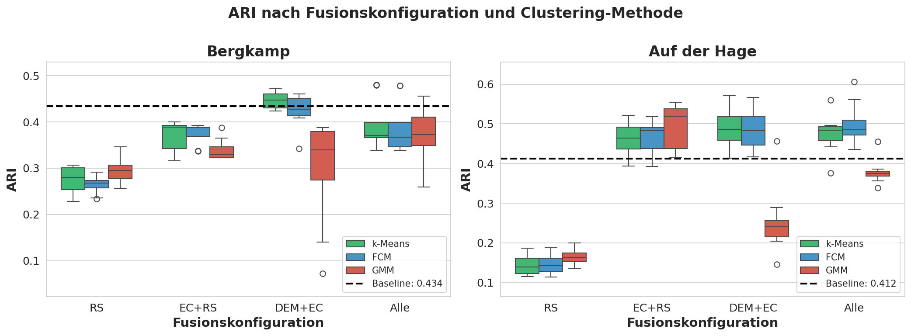
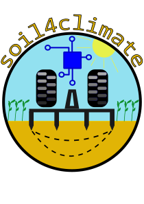

## Overview

Agricultural fields naturally exhibit spatial variations. These differences concern soil properties, nutrient content, water balance, or topography and influence plant growth as well as yield potential. To address this variability within a field, areas are divided into management zones.

Often, the derivation of zones is done through manual interpretation of historical yield maps, simplified soil data, digital terrain models, or point-sampled soil investigations. Accordingly, this study investigates the extent to which it is possible to identify homogeneous field areas not only based on two or three information sources and manual estimates, but multimodally, automatically, quickly, and deterministically.

Automated and reproducible processing can significantly reduce the effort and make the process more time-efficient, economical, and resource-friendly. At the same time, it allows for more flexible handling of different data sources and improves the objectivity and traceability of the results. Furthermore, the approach can easily be transferred to larger areas and other use cases.

For the investigations, various data sources (see table) are included, fused with each other, and evaluated against a ground truth created by a soil scientist.

| Data Source | GSD | Raster/Vector |
|--------|----------|----------|
| PlanetScope Super Dove | 3m | Raster |
| Drone | Altitude dependent (~ 5cm) | Raster |
| DEM | 1m | Raster |
| EC_a | 1m - 3m | Vector |
| Soil Estimation | 1:5000 | Vector |

## Experimental Pipeline

The following figure visualizes the architecture of the overall system. The pipeline is divided into three essential phases: First, the input data is harmonized and projected onto a common reference grid. Subsequently, modality-specific feature extraction takes place, before the feature vectors are fused, transformed into homogeneous zones using unsupervised learning, and finally compared with the ground truth.

<figure align="center">
    
    <figcaption> 
        <em>The various input modalities (left) are projected onto a common reference grid (center), processed, and fused. The result (top right) is a cluster map validated against an expert-based reference (bottom right), which is also rasterized.</em> 
    </figcaption>
</figure>

### Spatial Alignment

The basis for multimodal data integration is a uniform reference grid that divides the continuous field area into discrete cells. This grid serves as a common spatial reference level for all data sources and enables the systematic assignment of features from different modalities to the same geographic positions. The **grid cell resolution is 3 m × 3 m**, corresponding to the native GSD of the PlanetScope satellite imagery used. This resolution is below the 5 to 30 m typical in the literature and allows for finer spatial discretization for deriving homogeneous management zones.

### Feature Extraction from Satellite Imagery

To extract temporal information features, two approaches were investigated: a data-driven deep learning approach based on the **Clay Foundation Model** and a domain-knowledge-based approach using **spectral-temporal vegetation indices**.

For the Clay approach, the pre-trained encoder was used for feature extraction, and the resulting features were clustered with k-Means, FCM, and GMM. However, because the input scenes were too small and the required upsampling led to spectral distortions, this approach did not yield satisfactory results.

Therefore, for each spatially aligned PlanetScope scene, nine spectral indices were calculated and projected onto the reference grid. NDVI, SAVI, NDRE, NDWI, MSI, NDSI, BSI, BI, and the Red-Green Ratio were used. Due to the lack of a SWIR band, no indices based on it could be considered. This results in the vector matrix $\mathbf{X}_{3D} \in \mathbb{R}^{N \times T \times I}$.

<figure align="center">
    
    <figcaption>
        <em>Construction of the spectral-temporal Data Cube. For each PlanetScope scene in the time series, nine spectral indices are calculated at the native 3 m resolution. The resulting index maps of all scenes are stacked along the temporal axis into a three-dimensional data cube of dimension N × T × I, where N denotes the number of grid cells, T the number of acquisition times, and I = 9 the number of calculated indices.</em>
    </figcaption>
</figure>

For further analysis, the median over all acquisition times is formed for each grid cell and each index along the temporal axis. The resulting median composite has the dimension $\mathbb{R}^{N \times I}$ and describes each grid cell by a 9-dimensional feature vector.

### Feature Extraction from Drone Imagery

The drone imagery is based on recordings from the MicaSense Duo RedEdge-MX camera. To extract semantic features, a pre-trained ResNet18 encoder is used, which was pre-trained on the msuav500k dataset using self-supervised learning. Since the model was trained exclusively with four spectral channels, only the Red (668 nm), Green (560 nm), Red Edge (717 nm), and Near-Infrared (842 nm) channels are used from the ten available bands of the drone recordings. The first convolution layer of the network is accordingly designed for four input channels.

<figure align="center">
    
    <figcaption> 
        <em>Schematic structure of the modified ResNet18 encoder. The first convolution block (Conv1) was expanded to four input channels (R, G, RE, NIR). After passing through the residual blocks and global average pooling, a 512-dimensional feature vector is extracted; the original classification head is omitted.</em> 
    </figcaption>
</figure>

For each cell of the reference grid, an image patch is extracted and converted into a feature vector $\mathbf{x}_{i,j} \in \mathbb{R}^{512}$ by the encoder. Cells outside the field boundary are treated as $\mathrm{NaN}$ and not further considered. The input patches have a size of $224 \times 224$ pixels and contain additional spatial context with $f_{context}=1.5$ in addition to the actual $3 \times 3$ m grid cell. However, the extracted information is assigned exclusively to the central grid cell.

  

    
  

  

    
  

  

    
  

  <em>Exemplary input patches for the encoder in false-color representation. The red rectangle marks the target cell in the reference grid with a spatial extent of &nbsp;$3 \times 3$ m, while the surrounding area represents the additional context. The entire patch with a size of &nbsp;$224 \times 224$ pixels serves as input for the ResNet18.</em>

To reduce the high-dimensional feature space and extract the essential variance components, a MULTISPATI-PCA is subsequently performed. The result for each grid cell is a compact feature vector $v_{drone} \in \mathbb{R}^{32}$, which maps both high-resolution texture information and spatial coherence.

### Feature Extraction from DEM

From the 1 m resolution DEM tiles from the State Office for Geoinformation and Land Surveying Lower Saxony, topographic features relevant to hydrological processes, soil erosion, and nutrient distribution are derived using WhiteboxTools.

For multimodal analysis, these features are aggregated onto the 3 × 3 m reference grid. For each grid cell, the weighted mean values and standard deviations of the contained pixels are calculated to capture both the average relief and its small-scale variability.

The result is a feature vector $v_{dem} \in \mathbb{R}^{21}$ consisting of ten mean values, ten standard deviations, and exposure strength as a measure of directional consistency.

### Feature Extraction from EC_a Data

The conductivity measurements were first interpolated onto a regular point grid using Ordinary Kriging.

Aggregation onto the $3 \times 3$ m reference grid depends on the local point density. If at least four Kriging points lie within a grid cell, their median is used as a robust cell value. If the point coverage is insufficient, the $k=5$ nearest points to the cell centroid are determined and their values are averaged using inverse distance weighting (IDW).

### Feature Extraction from Soil Estimation

The official soil estimation is available as vector polygons with categorical class symbols and is therefore converted into quantitative texture parameters. The feature vector $v_{soil} \in \mathbb{R}^{3}$ comprises the proportions of sand, silt, and clay.

Distance-based blending is applied to model uncertainties at boundaries between different soil classes. For this purpose, only boundaries between polygons with differing class symbols are considered. For each cell center, the distance $d$ to the nearest class boundary is calculated. Within a transition zone ($d < d_{\text{max}}$), the texture values of the own and neighboring classes are mixed using distance weighting:

$$
w_{\text{own}}(d) = 0.5 + 0.5 \cdot \frac{d}{d_{\text{max}}},
\quad
w_{\text{neighbor}}(d) = 1 - w_{\text{own}}(d)
$$

A 50/50 mixture occurs directly on the class boundary; as the distance increases, the influence of the neighboring class decreases linearly until only the values of the own class are used outside the transition zone.

<figure align="center">
    
    <figcaption> 
        <em>Visualization of the vector-based blending process for the soil estimation data. Shown are the resulting texture proportions of sand, silt, and clay, as well as the modeled boundary uncertainty. Die graduellen Übergänge an den ursprünglichen Klassengrenzen entstehen durch die distanzgewichtete Mischung der Texturwerte innerhalb der Übergangszonen.</em> 
    </figcaption>
</figure>

### Fusion Strategies

To combine the normalized feature vectors, two fusion strategies are investigated, which have established themselves as standard methods in the literature on multimodal data integration. These include weighted concatenation and weighted summation with zero padding.

#### Weighted Concatenation
In weighted concatenation, the feature vectors from all data sources are appended sequentially. Each source $k$ is assigned a weighting factor $w_k$, where the sum of all weights is normalized to one. For a grid cell, the fused feature vector is given by

$$
\mathbf{z}_{total} = (w_{drone} \mathbf{x}^{(32)}_{drone}, w_{sat} \mathbf{x}^{(9)}_{sat}, w_{ec} \mathbf{x}^{(2)}_{ec}, w_{soil} \mathbf{x}^{(3)}_{soil}, w_{dem} \mathbf{x}^{(21)}_{dem}) \in \mathbb{R}^{67},\quad \sum_{k=1}^{K} w_k = 1
$$

where $\mathbf{x}^{(D_k)}_{k}$ denotes the feature vector of source $k$ with dimension $D_k$.

#### Weighted Summation with Zero Padding

In weighted summation, the feature vectors of all data sources are first brought to the same dimension using zero padding, starting from the modality with the highest dimension. In the present case, all feature vectors are expanded to the dimensionality of the drone-based features ($D_{drone} = 32$). For each feature vector $\mathbf{x}^{(k)}$ with $D_k < D_{drone}$, a padded vector $\tilde{\mathbf{x}}^{(k)}$ is generated:

$$
\tilde{\mathbf{x}}^{(k)} = (\mathbf{x}^{(k)}, \underbrace{0, \dots, 0}_{D_{drone} - D_k \text{ zeros}}) \in \mathbb{R}^{D_{drone}}
$$

Fusion is then carried out by weighted summation of the padded vectors:

$$
\mathbf{z}_{total} = \sum_{k=1}^{K} w_k \, \tilde{\mathbf{x}}_{k} \in \mathbb{R}^{32},\quad \sum_{k=1}^{K} w_k = 1
$$

where $w_k$ represents the respective weights and $\tilde{\mathbf{x}}_{k}$ the padded feature vectors.

### Rasterization of Ground Truth

For validation, the heterogeneous ground truth data is transferred to the reference grid to create a consistent spatial basis for comparison. For point data, assignment is done via KNN with $k=9$ followed by majority voting. For polygon data, the overlap area of each grid cell with the intersecting polygons is calculated.

### Results of Data Fusion

To validate the fused data sources, four fusion configurations with field-specific weightings were investigated on both study fields. In all cases, spatial smoothing with a Gaussian kernel ($r = 18$ m, $\sigma = 2.0$) was applied.

For each configuration, the two fusion methods *Weighted Concatenation* and *Weighted Sum* were evaluated. Since no UAV data was available for "Auf der Hage", the configuration *RS* there consists exclusively of satellite data and thus practically corresponds to the satellite baseline.

The following table shows the best fusion results compared to the respective best single source.

<figure align="center">
    <figcaption> 
        <em>Fusion results compared to ground truth. Maximum ARI and mIoU values are given, along with their relative change (Δ) compared to the best single source. Positive Δ values indicate improvement, negative indicate deterioration.</em> 
    </figcaption>

  

    <table class="fusion-table">
      <thead>
        <tr>
          <th rowSpan="2" class="border-b-heavy">No.</th>
          <th rowSpan="2" class="border-b-heavy">Method</th>
          <th colSpan="2" class="border-b-light">Bergkamp</th>
          <th colSpan="2" class="border-b-light">Auf der Hage</th>
        </tr>
        <tr>
          <th class="border-b-heavy">ARI (Δ)</th>
          <th class="border-b-heavy">mIoU (Δ)</th>
          <th class="border-b-heavy">ARI (Δ)</th>
          <th class="border-b-heavy">mIoU (Δ)</th>
        </tr>
      </thead>
      <tbody>
        <tr class="baseline-row">
          <td colSpan="2" style="text-align: left;" class="border-b-medium"><b>Best Baseline</b></td>
          <td class="border-b-medium">0.434</td>
          <td class="border-b-medium">0.615</td>
          <td class="border-b-medium">0.412</td>
          <td class="border-b-medium">0.594</td>
        </tr>
        <tr>
          <td rowSpan="2" class="border-b-light">1</td>
          <td>Concat</td>
          <td>0.306 (-29%)</td>
          <td>0.444 (-28%)</td>
          <td>0.200 (-51%)</td>
          <td>0.445 (-25%)</td>
        </tr>
        <tr>
          <td class="border-b-light">Sum</td>
          <td class="border-b-light">0.347 (-20%)</td>
          <td class="border-b-light">0.483 (-21%)</td>
          <td class="border-b-light">0.200 (-51%)</td>
          <td class="border-b-light">0.445 (-25%)</td>
        </tr>
        <tr>
          <td rowSpan="2" class="border-b-light">2</td>
          <td>Concat</td>
          <td>0.400 (-8%)</td>
          <td>0.507 (-18%)</td>
          <td><b>0.555 (+35%)*1</b></td>
          <td><b>0.678 (+14%)*2</b></td>
        </tr>
        <tr>
          <td class="border-b-light">Sum</td>
          <td class="border-b-light">0.388 (-11%)</td>
          <td class="border-b-light">0.507 (-18%)</td>
          <td class="border-b-light">0.541 (+31%)</td>
          <td class="border-b-light">0.674 (+13%)</td>
        </tr>
        <tr>
          <td rowSpan="2" class="border-b-light">3</td>
          <td>Concat</td>
          <td>0.461 (+6%)</td>
          <td>0.544 (-12%)</td>
          <td>0.527 (+28%)</td>
          <td>0.664 (+12%)</td>
        </tr>
        <tr>
          <td class="border-b-light">Sum</td>
          <td class="border-b-light"><b>0.473 (+9%)*3</b></td>
          <td class="border-b-light">0.548 (-11%)</td>
          <td class="border-b-light"><b>0.570 (+38%)*2</b></td>
          <td class="border-b-light"><b>0.686 (+15%)*4</b></td>
        </tr>
        <tr>
          <td rowSpan="2" class="border-b-heavy">4</td>
          <td>Concat</td>
          <td>0.479 (+10%)</td>
          <td>0.556 (-10%)</td>
          <td>0.561 (+36%)</td>
          <td>0.698 (+17%)</td>
        </tr>
        <tr>
          <td class="border-b-heavy">Sum</td>
          <td class="border-b-heavy"><b>0.480 (+11%)*2</b></td>
          <td class="border-b-heavy">0.555 (-10%)</td>
          <td class="border-b-heavy"><b>0.606 (+47%)*4</b></td>
          <td class="border-b-heavy"><b>0.731 (+23%)*4</b></td>
        </tr>
      </tbody>
    </table>
  

  

    
      *1 (GMM | 3) &nbsp;&nbsp;
      *2 (k-Means | 3) &nbsp;&nbsp;
      *3 (k-Means | 5) &nbsp;&nbsp;
      *4 (FCM | 3)
    
  

</figure>

The results show a clear field dependency of the fusion. On the "Bergkamp" field, the best agreement with the ground truth is achieved by fusing all modalities ($ARI = 0.480$, $+11\%$ compared to the best single source). A similarly positive, though smaller, improvement is obtained for *DEM+EC* with *Weighted Sum* ($+9\%$). In contrast, the pure remote sensing configuration (*RS*) remains clearly below the baseline.

On the "Auf der Hage" field, segmentation improves in almost all fusion configurations compared to the best single source. The best configuration here is also the fusion of all modalities with *Weighted Sum* ($ARI = 0.606$, $+47\%$; $mIoU = 0.731$, $+23\%$). This particularly highlights the added value of combining complementary data sources.

The following figure compares which of the two fusion methods achieves the higher ARI more frequently across all parameter combinations.

<figure align="center">
    
    <figcaption> 
        <em>Comparison of the fusion methods Weighted Concat and Weighted Sum. For each parameter combination, it was determined which method achieves the higher ARI. Shown is the percentage of wins per method – overall, by fusion configuration, and by field. Ties occur if both methods deliver identical ARI values.</em> 
    </figcaption>
</figure>

In addition to the fusion method, the number of clusters also influences the segmentation quality. Across all configurations, *k-Means* and *FCM* achieve the best results predominantly at $k=3$, while *GMM* is overall weaker and more unstable. With an increasing number of clusters, the average quality measures tend to decrease.

The following figure shows the ARI distribution by fusion configuration and illustrates which modality combinations are particularly suitable on the two study fields.

<figure align="center">
    
    <figcaption> 
        <em>Comparison of ARI values for the Bergkamp (left) and Auf der Hage (right) datasets, grouped by fusion configuration (RS, EC+RS, DEM+EC, All). The boxplots show the distribution of results for k-Means, FCM, and GMM compared to the respective baseline (dashed line). Outliers are shown as circles.</em> 
    </figcaption>
</figure>

It can be seen that the sole use of remote sensing data (*RS*) yields the weakest agreement on both fields. The highest median values are achieved primarily for *DEM+EC* and – on "Auf der Hage" – additionally for *EC+RS*. Across all configurations, *k-Means* and *FCM* prove to be robust, while *GMM* shows significantly higher volatility.

## Current and Future Work

- Using Cross-Modal Attention models for relationships and correlations between modalities
- Application of further extraction processes for the remote sensing modalities
- Investigations of XAI along the pipeline to validate results and evaluate the significance

## Collaboration

We collaborate with:

- agricultural robot manufacturers  
- research institutes  
- test fields  
- standardization bodies  

If you are interested in collaboration, please contact the  
**Intelligent Agricultural Systems Group – Hochschule Osnabrück**.

---
## Acknowledgments and Funding
This research was supported by the research project “Soil 4 Climate” funded by the Federal Ministry of Agriculture, Food and Regional Identity (BMLEH) based on a decision of the Parliament of the Federal Republic of Germany via the Federal Office for Agriculture and Food (BLE).

  

    
  

  

    
  

