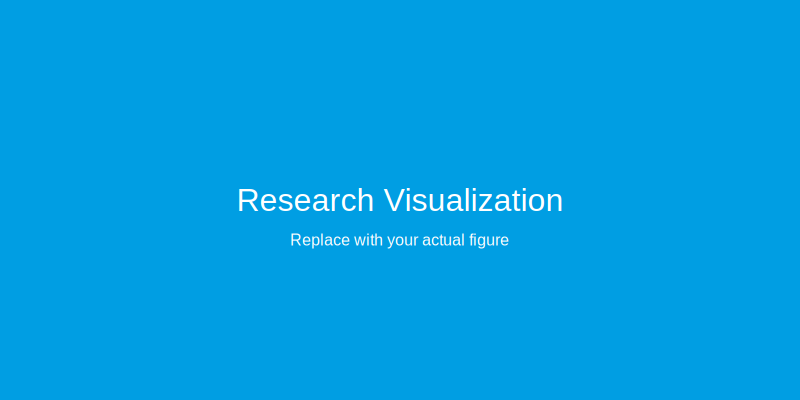

## Abstract

This template demonstrates the capabilities of MDX-based research topic pages. It showcases mathematical typesetting with KaTeX, various content layouts, code highlighting, tables, and rich text formatting suitable for presenting agricultural AI and robotics research.

## Mathematical Equations

### Inline Mathematics

You can write inline equations seamlessly within text: The relationship between energy and mass is given by $E = mc^2$, where $c$ is the speed of light. For vegetation indices, we often use $NDVI = \frac{\rho_{NIR} - \rho_{RED}}{\rho_{NIR} + \rho_{RED}}$ where $\rho$ denotes reflectance values.

### Block Equations

Display important equations prominently:

$$
\mathcal{L}(\theta) = -\frac{1}{N}\sum_{i=1}^{N}\left[y_i\log(\hat{y}_i) + (1-y_i)\log(1-\hat{y}_i)\right]
$$

### Complex Mathematical Expressions

Matrix operations:

$$
\begin{bmatrix}
x' \\
y' \\
1
\end{bmatrix} =
\begin{bmatrix}
\cos\theta & -\sin\theta & t_x \\
\sin\theta & \cos\theta & t_y \\
0 & 0 & 1
\end{bmatrix}
\begin{bmatrix}
x \\
y \\
1
\end{bmatrix}
$$

Optimization objectives in machine learning:

$$
\theta^* = \arg\min_\theta \frac{1}{2}\|\mathbf{y} - \mathbf{X}\theta\|_2^2 + \lambda\|\theta\|_1
$$

Statistical formulas for data analysis:

$$
\sigma^2 = \frac{1}{N-1}\sum_{i=1}^{N}(x_i - \bar{x})^2
$$

Bayesian inference:

$$
P(\theta|D) = \frac{P(D|\theta)P(\theta)}{P(D)} = \frac{P(D|\theta)P(\theta)}{\int P(D|\theta')P(\theta')d\theta'}
$$

## Images and Figures

Standard image embedding with automatic styling using local images:


*Figure 1: Example of a full-width figure with caption. Images are automatically styled with rounded corners. Place your images in the same folder as the index.mdx file and reference them with `./filename.ext`*

## Code Blocks

### Python Implementation

```python
import numpy as np

class MyClass:
    def __init__(self, param=100):
        self.value = param
        self.items = ['foo', 'bar', 'baz', 'qux']

    def process_data(self, data):
        """Process input data"""
        return (data - self.mean) / self.std

    def calculate(self, input_data):
        """Perform calculation"""
        processed = self.process_data(input_data)
        result = np.mean(processed)
        return result

# Example usage
obj = MyClass()
output = obj.calculate(data)
```

### Shell Commands

```bash
# Example command pipeline
python script1.py --input data/ --output results/
python script2.py --config config.yaml --param 100
python script3.py --model model.pth --test test_data/
```

## Tables and Data

### Example Results Table

| Method | Metric A | Metric B | Metric C | Metric D | Time (ms) |
|--------|----------|----------|----------|----------|-----------|
| Approach 1 | 87.3% | 86.1% | 85.4% | 85.7% | 12.3 |
| Approach 2 | 92.1% | 91.8% | 90.9% | 91.3% | 28.7 |
| Approach 3 | 93.6% | 93.2% | 92.8% | 93.0% | 18.4 |
| Approach 4 | **94.8%** | **94.5%** | **94.1%** | **94.3%** | **15.2** |

*Table 1: Example comparison table with multiple metrics.*

### Example Data Table

| Category | Group A | Group B | Group C | Value |
|----------|---------|---------|---------|-------|
| Type 1 | 12,450 | 2,100 | 3,200 | 8 |
| Type 2 | 15,320 | 2,680 | 4,100 | 12 |
| Type 3 | 9,870 | 1,650 | 2,500 | 6 |
| Type 4 | 8,200 | 1,400 | 2,150 | 10 |

*Table 2: Example data table with multiple columns.*

## Lists and Structure

### Unordered Lists

Example list items:

- Lorem ipsum dolor sit amet consectetur adipiscing elit
- Sed do eiusmod tempor incididunt ut labore
- Ut enim ad minim veniam quis nostrud exercitation
- Duis aute irure dolor in reprehenderit
- Excepteur sint occaecat cupidatat non proident

### Ordered Lists

Example numbered steps:

1. Lorem ipsum dolor sit amet consectetur adipiscing elit
2. Sed do eiusmod tempor incididunt ut labore et dolore
3. Ut enim ad minim veniam quis nostrud exercitation
4. Duis aute irure dolor in reprehenderit in voluptate
5. Excepteur sint occaecat cupidatat non proident
6. Sunt in culpa qui officia deserunt mollit anim

### Nested Lists

Example nested structure:

- **Category One**
  - Lorem ipsum dolor sit amet
  - Consectetur adipiscing elit sed do
  - Eiusmod tempor incididunt ut labore
  - Optional: Dolore magna aliqua

- **Category Two**
  - Ut enim ad minim veniam
  - Quis nostrud exercitation ullamco
  - Laboris nisi ut aliquip ex ea
  - Commodo consequat duis aute irure

## Blockquotes and Highlights

> "Lorem ipsum dolor sit amet, consectetur adipiscing elit, sed do eiusmod tempor incididunt ut labore et dolore magna aliqua."
>
> — Example Attribution

Example note format:

> **Note:** Lorem ipsum dolor sit amet consectetur adipiscing elit. Sed do eiusmod tempor incididunt ut labore et dolore.

## Text Formatting

Standard text formatting options:

- **Bold text** for strong emphasis
- *Italic text* for subtle emphasis
- ***Bold and italic*** for maximum emphasis
- `inline code` for technical terms like `sklearn.ensemble` or file paths
- ~~Strikethrough~~ for deprecated methods
- [Links to external sites](https://www.hs-osnabrueck.de) or [specific pages](https://www.hs-osnabrueck.de/prof-dr-stefan-stiene/)

Example with inline code: Lorem ipsum `dolor()` sit amet, consectetur `adipiscing()` elit sed do eiusmod.

You can also reference [University of Applied Sciences Osnabrück](https://www.hs-osnabrueck.de) in your text with links.

## Citations and Bibliography

### Automatic Citations

You can cite papers using their BibTeX keys from the `bibliography.bib` file, and they'll be automatically formatted.

For example, lorem ipsum dolor sit amet [@barrelmeyer2025] consectetur adipiscing elit sed do eiusmod tempor incididunt ut labore.

To display the bibliography with all cited works, add `[^ref]` where you want it to appear (see the References section below for an example).

### Managing Your Bibliography

All references are stored in the shared `bibliography.bib` file at the project root. Add your BibTeX entries there:

```bibtex
@Article{barrelmeyer2025,
  AUTHOR = {Barrelmeyer, Daniel and Stiene, Stefan and Jose, Jannik and Porrmann, Mario},
  TITLE = {Mobile Ground-Truth 3D Detection Environment for Agricultural Robot Field Testing},
  JOURNAL = {Sensors},
  VOLUME = {25},
  YEAR = {2025},
  DOI = {10.3390/s25134103}
}

@article{yourname2026,
  title={Your Research Title},
  author={Your Name and Co-Author},
  journal={Your Journal},
  year={2026}
}
```

Citation keys follow the format `firstauthor+year` (e.g., `barrelmeyer2025`, `yourname2026`). Then cite them in any topic using `[@barrelmeyer2025]` or `[@yourname2026]`.

**Important:** Add `[^ref]` where you want the bibliography to appear **ONLY if you have citations in your document**. If you don't add `[^ref]` and have no citations, no bibliography will appear. If you have citations but no `[^ref]`, the bibliography appears automatically at the end.

---

## References

[^ref]

---

## Creating Your Own Research Topic

To create a new research topic:

1. **Create a folder** in `src/content/topics/` with your topic name (e.g., `my-topic`; will be the URL slug).

2. **Create index.md** inside that folder with frontmatter and content:
   ```yaml
   ---
   contentType: topic
   title: "Your Research Title"
   description: "Brief description"
   authors:
     - "Author One"
     - "Author Two"
   date: 2026-01-26
   thumbnail: ./image.jpg  # optional
   externalUrl: "https://example.com"  # optional
   codeUrl: "https://github.com/user/repo"  # optional
   ---

   ## Your Content Here

   Lorem ipsum...
   ```

3. **Add any assets** (images, data files) to the same folder and reference them with relative paths: `./filename.ext`

4. **For citations**, add entries to `bibliography.bib` in the project root and use `[@citationkey]` syntax. Add `[^ref]` where you want the bibliography to appear.

**Folder structure:**
```
project-root/
  bibliography.bib
  src/content/topics/
    my-topic/
      index.md
      image.jpg
```